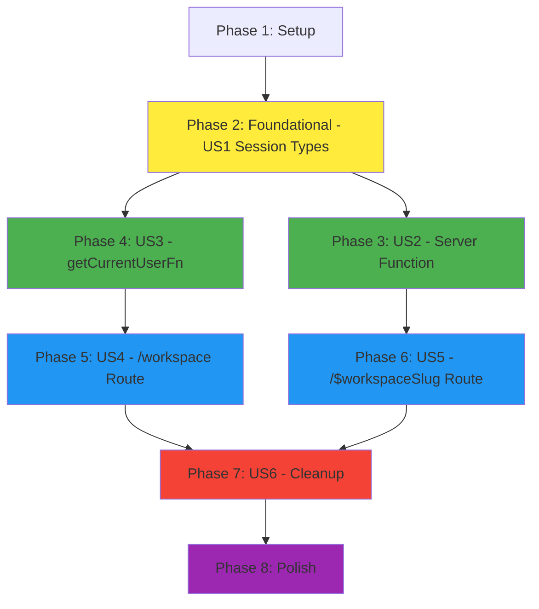

# Implementation Tasks: Server Session Workspace Persistence

**Feature**: Server Session Workspace Persistence
**Branch**: `010-session-workspace-persistence`
**Status**: Ready for Implementation

---

## Overview

This document breaks down the implementation of server-side workspace session persistence into actionable tasks. Tasks are organized by functional requirement (user story) to enable independent, incremental delivery.

**Total Estimated Tasks**: 16
**Phases**: 4 (Setup, Foundational, User Stories 1-4, Polish)

---

## Implementation Strategy

### MVP Scope (User Story 1-3)
The minimum viable product includes:
- ✅ **US1**: Session type extensions (SessionData, SessionUser)
- ✅ **US2**: Server function to update workspace preference
- ✅ **US3**: Enhanced getCurrentUserFn to return workspace preference

This MVP enables the core functionality without UI changes - perfect for testing session persistence in isolation.

### Full Feature Scope (Add US4-6)
Complete feature delivery includes:
- ✅ **US4**: Server-side redirect in /workspace route
- ✅ **US5**: Client-side workspace save in /workspace/$workspaceSlug
- ✅ **US6**: Remove Zustand store (cleanup)

### Incremental Delivery Benefits
- Each user story is independently testable
- Can deploy US1-3 without affecting current UI (types are backwards compatible)
- US4-5 can be deployed together (redirect implementation)
- US6 is pure cleanup (safe to do last or skip if rollback needed)

---

## Phase 1: Setup

**Goal**: Prepare development environment and verify existing architecture

**Duration**: 10 minutes

**Prerequisites**: None

### Tasks

- [ ] T001 Verify feature branch is checked out (010-session-workspace-persistence)
- [ ] T002 [P] Read existing session types in apps/clementine-app/src/domains/auth/types/session.types.ts
- [ ] T003 [P] Read existing createSessionFn in apps/clementine-app/src/domains/auth/server/functions.ts
- [ ] T004 [P] Read existing getCurrentUserFn in apps/clementine-app/src/domains/auth/server/functions.ts
- [ ] T005 Run pnpm app:check to verify clean starting state

**Completion Criteria**:
- ✅ All existing auth session code understood
- ✅ No type errors or linting issues in baseline

---

## Phase 2: Foundational (Blocking Prerequisites)

**Goal**: Extend session types to support workspace preference (foundational for all user stories)

**Duration**: 10 minutes

**Prerequisites**: Phase 1 complete

**User Story**: US1 - Session Extension

This phase is foundational because session types are used by all subsequent user stories. Must be completed before any server functions or routes can be modified.

### Tasks

- [ ] T006 Extend SessionData interface with lastVisitedWorkspaceSlug field in apps/clementine-app/src/domains/auth/types/session.types.ts
- [ ] T007 Extend SessionUser interface with lastVisitedWorkspaceSlug field in apps/clementine-app/src/domains/auth/types/session.types.ts
- [ ] T008 Run pnpm app:check to verify type changes compile without errors

**Completion Criteria**:
- ✅ SessionData includes `lastVisitedWorkspaceSlug?: string`
- ✅ SessionUser includes `lastVisitedWorkspaceSlug?: string`
- ✅ No type errors (backwards compatible - optional field)

**Independent Test**:
```typescript
// Test type extensions exist
import type { SessionData, SessionUser } from '@/domains/auth/types/session.types'

const sessionData: SessionData = {
  userId: 'test123',
  email: 'test@example.com',
  isAdmin: true,
  isAnonymous: false,
  lastVisitedWorkspaceSlug: 'test-workspace' // Should compile
}

const sessionUser: SessionUser = {
  userId: 'test123',
  email: 'test@example.com',
  isAdmin: true,
  isAnonymous: false,
  lastVisitedWorkspaceSlug: 'test-workspace' // Should compile
}
```

---

## Phase 3: User Story 2 - Server Function: Set Last Visited Workspace

**Goal**: Implement server function to update workspace preference in session

**Duration**: 20 minutes

**Prerequisites**: Phase 2 (session types extended)

**Dependencies**: None (independent of other user stories)

### Tasks

- [ ] T009 [US2] Create setLastVisitedWorkspaceFn server function in apps/clementine-app/src/domains/auth/server/functions.ts
- [ ] T010 [US2] Add input validator to setLastVisitedWorkspaceFn for workspaceSlug parameter
- [ ] T011 [US2] Implement authentication check (userId must exist in session)
- [ ] T012 [US2] Implement session update with field preservation (spread operator)
- [ ] T013 [US2] Export setLastVisitedWorkspaceFn from apps/clementine-app/src/domains/auth/server/index.ts
- [ ] T014 [US2] Run pnpm app:check to verify server function compiles

**Completion Criteria**:
- ✅ `setLastVisitedWorkspaceFn` server function created
- ✅ Input validation: `workspaceSlug` is required, non-empty string
- ✅ Authentication check: returns `{ success: false, error: 'Unauthenticated' }` if no userId
- ✅ Session update: preserves existing fields (userId, email, isAdmin, isAnonymous)
- ✅ Returns `{ success: true }` on successful update

**Independent Test** (Manual in Browser DevTools):
```typescript
// Import server function
import { setLastVisitedWorkspaceFn } from '@/domains/auth/server/functions'
import { useServerFn } from '@tanstack/react-start/client'

// In a component or console:
const setWorkspace = useServerFn(setLastVisitedWorkspaceFn)

// Test authenticated call
await setWorkspace({ data: { workspaceSlug: 'test-workspace' } })
// Expected: { success: true }

// Test unauthenticated call (logout first)
await setWorkspace({ data: { workspaceSlug: 'test-workspace' } })
// Expected: { success: false, error: 'Unauthenticated' }
```

---

## Phase 4: User Story 3 - Get Current User Enhancement

**Goal**: Enhance getCurrentUserFn to return workspace preference

**Duration**: 10 minutes

**Prerequisites**: Phase 2 (session types extended)

**Dependencies**: None (independent of US2)

### Tasks

- [ ] T015 [P] [US3] Update getCurrentUserFn to include lastVisitedWorkspaceSlug in destructuring in apps/clementine-app/src/domains/auth/server/functions.ts
- [ ] T016 [P] [US3] Update getCurrentUserFn return statement to include lastVisitedWorkspaceSlug field
- [ ] T017 [US3] Run pnpm app:check to verify changes compile
- [ ] T018 [US3] Update createSessionFn to preserve existing lastVisitedWorkspaceSlug on token refresh in apps/clementine-app/src/domains/auth/server/functions.ts

**Completion Criteria**:
- ✅ `getCurrentUserFn` returns `lastVisitedWorkspaceSlug` when present in session
- ✅ `createSessionFn` preserves workspace preference on token refresh
- ✅ Backwards compatible (field is optional)

**Independent Test** (Manual in Browser DevTools):
```typescript
import { getCurrentUserFn, setLastVisitedWorkspaceFn } from '@/domains/auth/server/functions'
import { useServerFn } from '@tanstack/react-start/client'

// Setup: Set a workspace preference
const setWorkspace = useServerFn(setLastVisitedWorkspaceFn)
await setWorkspace({ data: { workspaceSlug: 'test-workspace' } })

// Test: Get current user
const user = await getCurrentUserFn()
console.log(user.lastVisitedWorkspaceSlug)
// Expected: 'test-workspace'

// Test: Token refresh preserves preference
// (Trigger token refresh via Firebase Auth - wait 1 hour or manually refresh)
// Then check again:
const userAfterRefresh = await getCurrentUserFn()
console.log(userAfterRefresh.lastVisitedWorkspaceSlug)
// Expected: 'test-workspace' (still present)
```

---

## Phase 5: User Story 4 - Route: /workspace Index Redirect

**Goal**: Implement server-side redirect logic in /workspace route

**Duration**: 20 minutes

**Prerequisites**: Phase 4 (getCurrentUserFn returns workspace preference)

**Dependencies**: US3 (requires getCurrentUserFn enhancement)

### Tasks

- [ ] T019 [US4] Replace entire /workspace/index.tsx with server-side beforeLoad redirect logic in apps/clementine-app/src/app/workspace/index.tsx
- [ ] T020 [US4] Import getCurrentUserFn and isAdmin helper in apps/clementine-app/src/app/workspace/index.tsx
- [ ] T021 [US4] Implement beforeLoad logic: check admin, redirect based on lastVisitedWorkspaceSlug
- [ ] T022 [US4] Remove old WorkspaceRedirect component and useWorkspaceStore import from apps/clementine-app/src/app/workspace/index.tsx
- [ ] T023 [US4] Run pnpm app:check to verify route changes compile

**Completion Criteria**:
- ✅ Admin visiting `/workspace` with workspace history → instant redirect to `/workspace/$lastVisitedWorkspaceSlug`
- ✅ Admin visiting `/workspace` without history → instant redirect to `/admin/workspaces`
- ✅ Non-admin visiting `/workspace` → redirect to `/login`
- ✅ No "Loading..." visible (redirect happens in beforeLoad)
- ✅ No useWorkspaceStore usage in file

**Independent Test** (Manual in Browser):
```bash
# Scenario 1: User with workspace history
1. Login as admin
2. Visit /workspace/acme-corp (any valid workspace)
3. Navigate to /workspace
   Expected: Instantly redirected to /workspace/acme-corp (no loading flash)

# Scenario 2: User without workspace history
1. Clear session (logout + login) OR use new incognito window
2. Navigate to /workspace
   Expected: Instantly redirected to /admin/workspaces

# Scenario 3: Non-admin user
1. Logout, login as non-admin (if exists in system)
2. Navigate to /workspace
   Expected: Redirected to /login
```

---

## Phase 6: User Story 5 - Route: /workspace/$workspaceSlug Layout

**Goal**: Update workspace layout to save preference after successful workspace load

**Duration**: 15 minutes

**Prerequisites**: Phase 3 (setLastVisitedWorkspaceFn exists)

**Dependencies**: US2 (requires setLastVisitedWorkspaceFn)

### Tasks

- [ ] T024 [US5] Import setLastVisitedWorkspaceFn and useServerFn in apps/clementine-app/src/app/workspace/$workspaceSlug.tsx
- [ ] T025 [US5] Replace useWorkspaceStore with useServerFn(setLastVisitedWorkspaceFn) in WorkspaceLayout component
- [ ] T026 [US5] Update useEffect to call setLastVisitedWorkspaceFn only when isSuccess && workspace in apps/clementine-app/src/app/workspace/$workspaceSlug.tsx
- [ ] T027 [US5] Remove useWorkspaceStore import from apps/clementine-app/src/app/workspace/$workspaceSlug.tsx
- [ ] T028 [US5] Run pnpm app:check to verify changes compile

**Completion Criteria**:
- ✅ Visiting valid workspace → session updated with workspace slug
- ✅ Visiting invalid workspace (404) → session NOT updated
- ✅ No useWorkspaceStore usage in file

**Independent Test** (Manual in Browser + DevTools):
```bash
# Scenario 1: Valid workspace saves to session
1. Open DevTools Network tab
2. Visit /workspace/acme-corp (valid workspace)
3. Wait for workspace to load successfully
4. Check Network tab for POST request to setLastVisitedWorkspaceFn
   Expected: Request sent with workspaceSlug: 'acme-corp'
5. Navigate to /workspace
   Expected: Redirected to /workspace/acme-corp (confirms session saved)

# Scenario 2: Invalid workspace does NOT save
1. Visit /workspace/nonexistent-workspace-xyz
2. Wait for 404 / WorkspaceNotFound
3. Check Network tab - should NOT see POST to setLastVisitedWorkspaceFn
4. Navigate to /workspace
   Expected: Redirected to previous valid workspace OR /admin/workspaces (not nonexistent)
```

---

## Phase 7: User Story 6 - Cleanup: Remove Zustand Store

**Goal**: Remove Zustand store and localStorage dependencies

**Duration**: 10 minutes

**Prerequisites**: Phase 5 & 6 (routes updated to use server session)

**Dependencies**: US4, US5 (routes must use server session before removing Zustand)

### Tasks

- [ ] T029 [US6] Delete apps/clementine-app/src/domains/workspace/store/useWorkspaceStore.ts file
- [ ] T030 [US6] Remove useWorkspaceStore export from apps/clementine-app/src/domains/workspace/index.ts
- [ ] T031 [US6] Search codebase for any remaining useWorkspaceStore imports (should be zero)
- [ ] T032 [US6] Run pnpm app:check to verify no broken imports

**Completion Criteria**:
- ✅ `useWorkspaceStore.ts` file deleted
- ✅ No useWorkspaceStore export in workspace domain index
- ✅ No remaining imports of useWorkspaceStore in codebase
- ✅ No type errors or linting issues

**Independent Test** (Grep):
```bash
# Verify no remaining references
cd apps/clementine-app
grep -r "useWorkspaceStore" src/
# Expected: No results

grep -r "workspace-storage" src/
# Expected: No results (localStorage key from Zustand persist)

# Verify file deleted
ls src/domains/workspace/store/
# Expected: "No such file or directory" OR empty directory
```

---

## Phase 8: Polish & Validation

**Goal**: Final validation, testing, and code quality checks

**Duration**: 20 minutes

**Prerequisites**: Phase 7 (all user stories complete)

### Tasks

- [ ] T033 Run pnpm app:check (format, lint, type-check) from apps/clementine-app
- [ ] T034 Verify no localStorage references remain in workspace domain
- [ ] T035 Test end-to-end flow: login → visit workspace → navigate to /workspace → redirect works
- [ ] T036 Test cross-tab session persistence (open /workspace in Tab 2 after visiting workspace in Tab 1)
- [ ] T037 Test invalid workspace doesn't corrupt session (visit /workspace/nonexistent → no session update)
- [ ] T038 Standards compliance review: frontend/architecture.md, global/code-quality.md, global/project-structure.md

**Completion Criteria**:
- ✅ All acceptance criteria from spec.md met
- ✅ No lint, format, or type errors
- ✅ End-to-end flows verified manually
- ✅ Standards compliance verified

**Acceptance Criteria (from spec.md)**:
- [ ] Admin visiting `/workspace` is instantly redirected to last workspace (no loading state)
- [ ] Admin visiting `/workspace` with no history redirects to `/admin/workspaces`
- [ ] Visiting a valid workspace updates session preference
- [ ] Visiting an invalid workspace does NOT update session preference
- [ ] Token refresh preserves `lastVisitedWorkspaceSlug`
- [ ] Logout clears `lastVisitedWorkspaceSlug` (session cleared)
- [ ] Zustand store completely removed from codebase
- [ ] No localStorage usage for workspace persistence

---

## Dependency Graph



**Legend**:
- 🟡 **Foundational** (Yellow) - Blocking prerequisite for all user stories
- 🟢 **Independent** (Green) - US2 and US3 can be done in parallel
- 🔵 **Dependent** (Blue) - US4 depends on US3, US5 depends on US2
- 🔴 **Cleanup** (Red) - US6 depends on US4 and US5
- 🟣 **Polish** (Purple) - Final validation

**Critical Path**: Setup → Foundational → US3 → US4 → US6 → Polish (longest path)

**Parallelization Opportunities**:
- ✅ US2 and US3 can run in parallel (both depend only on Foundational)
- ✅ Tasks within Setup (T002, T003, T004) can run in parallel
- ✅ Tasks T015, T016 in US3 can run in parallel (different locations in same file)

---

## Parallel Execution Examples

### Maximum Parallelism (if 2 developers)

**Developer 1**:
```
Phase 1: T001 → T002, T003, T004, T005
Phase 2: T006, T007, T008
Phase 3: US2 (T009-T014)
Phase 6: US5 (T024-T028)
```

**Developer 2**:
```
Phase 1: (wait or help with setup)
Phase 2: (wait or pair on types)
Phase 4: US3 (T015-T018)
Phase 5: US4 (T019-T023)
```

**Both together**:
```
Phase 7: US6 (T029-T032)
Phase 8: Polish (T033-T038)
```

### Solo Developer (Optimal Order)

```
Day 1 (Setup + MVP):
  Setup: T001-T005
  Foundational: T006-T008
  US2: T009-T014
  US3: T015-T018
  ✅ MVP Complete (session persistence working, no UI changes)

Day 2 (Full Feature):
  US4: T019-T023
  US5: T024-T028
  US6: T029-T032
  Polish: T033-T038
  ✅ Full Feature Complete
```

---

## Rollback Plan

If issues arise after deployment:

1. **Revert US6** (Cleanup):
   - Restore `useWorkspaceStore.ts` from git history
   - Restore old imports in routes

2. **Revert US4-US5** (Routes):
   - Restore old client-side redirect in `/workspace/index.tsx`
   - Restore old Zustand usage in `/workspace/$workspaceSlug.tsx`

3. **Keep US1-US3** (Types + Server Function):
   - Session types are backwards compatible (optional field)
   - Server function can remain (unused won't break anything)
   - Can re-enable later without code changes

---

## Task Summary

**Total Tasks**: 38
**Parallelizable Tasks**: 7 (marked with [P])

**By Phase**:
- Phase 1 (Setup): 5 tasks
- Phase 2 (Foundational): 3 tasks
- Phase 3 (US2): 6 tasks
- Phase 4 (US3): 4 tasks
- Phase 5 (US4): 5 tasks
- Phase 6 (US5): 5 tasks
- Phase 7 (US6): 4 tasks
- Phase 8 (Polish): 6 tasks

**By User Story**:
- US1 (Session Extension): 3 tasks (Foundational)
- US2 (Server Function): 6 tasks
- US3 (getCurrentUserFn): 4 tasks
- US4 (/workspace Route): 5 tasks
- US5 (/$workspaceSlug Route): 5 tasks
- US6 (Cleanup): 4 tasks

---

## References

- **Plan**: [plan.md](./plan.md) - Technical context, constitution check
- **Spec**: [spec.md](./spec.md) - Functional requirements, acceptance criteria
- **Research**: [research.md](./research.md) - Technical decisions, patterns
- **Data Model**: [data-model.md](./data-model.md) - Session structure, types
- **Contracts**: [contracts/server-functions.md](./contracts/server-functions.md) - API contracts
- **Quickstart**: [quickstart.md](./quickstart.md) - Step-by-step implementation guide
