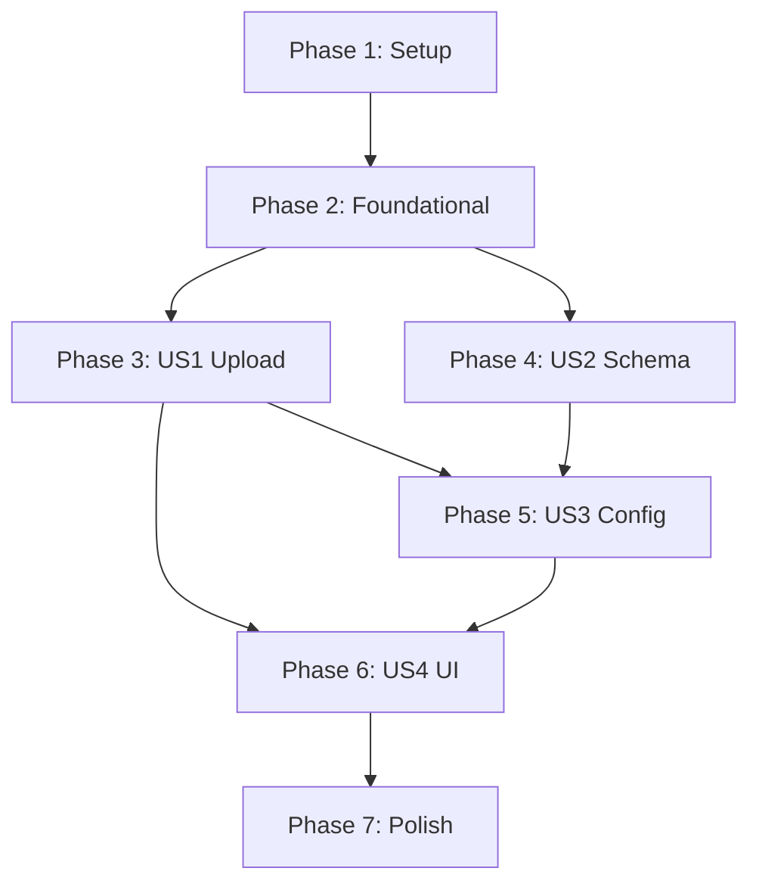

# Implementation Tasks: Event Settings - Overlay Configuration

**Feature**: 013-event-settings-overlays
**Branch**: `013-event-settings-overlays`
**Estimated Time**: 4-6 hours
**Complexity**: Medium

## Overview

This document defines all implementation tasks for overlay configuration feature. Tasks are organized by user story to enable independent implementation and testing.

**Architecture**: Client-first with Firebase client SDKs (Firestore + Storage)
**Domains**: `media-library` (NEW), `event/settings` (UPDATED)
**Testing Strategy**: Unit tests for schemas and validation, component tests for UI

---

## Task Summary

| Phase | User Story | Task Count | Parallelizable | Time Est. |
|-------|-----------|------------|----------------|-----------|
| Phase 1 | Setup | 6 | 3 | 30-45 min |
| Phase 2 | Foundational | 3 | 1 | 30-45 min |
| Phase 3 | US1: Upload Infrastructure | 10 | 4 | 1.5-2 hours |
| Phase 4 | US2: Media Library Schema | 4 | 2 | 30 min |
| Phase 5 | US3: Event Config Integration | 5 | 2 | 45 min |
| Phase 6 | US4: UI Components | 11 | 4 | 2-3 hours |
| Phase 7 | Polish & Validation | 8 | 3 | 45 min |
| **Total** | **4 Stories** | **47** | **19** | **4-6 hours** |

---

## Phase 1: Setup & Project Initialization

**Goal**: Create project structure for new media-library domain and prepare existing event domain for updates.

### Tasks

- [ ] T001 Create media-library domain directory structure in apps/clementine-app/src/domains/media-library/
- [ ] T002 [P] Create media-library hooks directory in apps/clementine-app/src/domains/media-library/hooks/
- [ ] T003 [P] Create media-library schemas directory in apps/clementine-app/src/domains/media-library/schemas/
- [ ] T004 [P] Create media-library types directory in apps/clementine-app/src/domains/media-library/types/
- [ ] T005 Create barrel export file in apps/clementine-app/src/domains/media-library/index.ts
- [ ] T006 Verify event/settings domain structure exists at apps/clementine-app/src/domains/event/settings/

**Notes**:
- Tasks T002-T004 can run in parallel (different directories)
- All paths are absolute from monorepo root
- Verify Firebase SDK 12.5.0+ is available in package.json

---

## Phase 2: Foundational Infrastructure

**Goal**: Set up shared schemas and types that all user stories depend on.

**Prerequisites**: Phase 1 must be complete

### Tasks

- [ ] T007 Create MediaAsset Zod schema in apps/clementine-app/src/domains/media-library/schemas/media-asset.schema.ts
- [ ] T008 [P] Create media types file in apps/clementine-app/src/domains/media-library/types/media.types.ts
- [ ] T009 Create barrel exports for media-library schemas in apps/clementine-app/src/domains/media-library/schemas/index.ts

**Testing Criteria (Independent)**:
- [ ] MediaAsset schema validates valid data correctly
- [ ] MediaAsset schema rejects invalid data (missing fields, wrong types)
- [ ] TypeScript compilation succeeds with strict mode
- [ ] All barrel exports resolve correctly

**Schema Reference**: See `data-model.md` Entity 1 for complete MediaAsset schema definition

---

## Phase 3: US1 - Upload Infrastructure

**User Story**: As a workspace admin, I want to upload overlay images so that I can configure event overlays.

**Goal**: Implement complete file upload infrastructure with Firebase Storage, progress tracking, and Firestore document creation.

**Prerequisites**: Phase 2 complete

**Test Criteria (Independent)**:
- [ ] File validation rejects invalid types (SVG, GIF, PDF)
- [ ] File validation rejects files > 5MB
- [ ] File validation accepts PNG, JPG, WebP ≤ 5MB
- [ ] Image dimensions extracted correctly from uploaded file
- [ ] Upload to Firebase Storage succeeds with progress tracking (0-100%)
- [ ] MediaAsset Firestore document created with all required fields
- [ ] Hook returns { mediaAssetId, url } after successful upload
- [ ] Query invalidation triggers after upload success

### Tasks

- [ ] T010 [US1] Create file validation constants in apps/clementine-app/src/domains/media-library/hooks/useUploadMediaAsset.ts
- [ ] T011 [P] [US1] Implement validateFile helper function in apps/clementine-app/src/domains/media-library/hooks/useUploadMediaAsset.ts
- [ ] T012 [P] [US1] Implement getImageDimensions helper function in apps/clementine-app/src/domains/media-library/hooks/useUploadMediaAsset.ts
- [ ] T013 [P] [US1] Implement generateFileName helper function in apps/clementine-app/src/domains/media-library/hooks/useUploadMediaAsset.ts
- [ ] T014 [US1] Implement Firebase Storage upload with uploadBytesResumable in apps/clementine-app/src/domains/media-library/hooks/useUploadMediaAsset.ts
- [ ] T015 [US1] Implement progress tracking callback for upload task in apps/clementine-app/src/domains/media-library/hooks/useUploadMediaAsset.ts
- [ ] T016 [US1] Implement getDownloadURL call after upload completes in apps/clementine-app/src/domains/media-library/hooks/useUploadMediaAsset.ts
- [ ] T017 [US1] Implement Firestore addDoc to create MediaAsset document in apps/clementine-app/src/domains/media-library/hooks/useUploadMediaAsset.ts
- [ ] T018 [P] [US1] Wrap upload logic in useMutation hook with TanStack Query in apps/clementine-app/src/domains/media-library/hooks/useUploadMediaAsset.ts
- [ ] T019 [US1] Create barrel export for useUploadMediaAsset in apps/clementine-app/src/domains/media-library/hooks/index.ts

**Implementation Notes**:
- Use `nanoid()` for unique file naming: `overlay-${nanoid()}.${ext}`
- Firebase Storage path: `workspaces/${workspaceId}/media/${fileName}`
- Firestore collection: `workspaces/${workspaceId}/mediaAssets`
- Progress tracking: `(snapshot.bytesTransferred / snapshot.totalBytes) * 100`
- See `research.md` sections 1-5 for detailed patterns

---

## Phase 4: US2 - Media Library Schema

**User Story**: As a workspace admin, I want my uploaded media to be reusable across events so that I don't have to re-upload the same overlay multiple times.

**Goal**: Create reusable media asset schema and types that can be referenced by events.

**Prerequisites**: Phase 2 complete (can run parallel to Phase 3)

**Test Criteria (Independent)**:
- [ ] OverlayReference schema validates { mediaAssetId, url } correctly
- [ ] OverlayReference schema accepts null values
- [ ] OverlaysConfig schema validates 1:1 and 9:16 overlay references
- [ ] Schema exports are available via barrel exports
- [ ] TypeScript types inferred correctly from schemas

### Tasks

- [ ] T020 [P] [US2] Add OverlayReference schema to apps/clementine-app/src/domains/event/shared/schemas/project-event-config.schema.ts
- [ ] T021 [US2] Update OverlaysConfig schema to use OverlayReference in apps/clementine-app/src/domains/event/shared/schemas/project-event-config.schema.ts
- [ ] T022 [P] [US2] Export OverlayReference type from schema in apps/clementine-app/src/domains/event/shared/schemas/project-event-config.schema.ts
- [ ] T023 [US2] Update schema barrel export to include OverlayReference in apps/clementine-app/src/domains/event/shared/schemas/index.ts

**Implementation Notes**:
- OverlayReference: `z.object({ mediaAssetId: z.string(), url: z.string().url() }).nullable()`
- Backward compatible with existing simple URL format
- See `data-model.md` Entity 2 for complete schema definition

---

## Phase 5: US3 - Event Config Integration

**User Story**: As a workspace admin, I want my overlay uploads to automatically save to the event configuration so that I don't have to manually link them.

**Goal**: Implement event configuration update hook that saves overlay references to Firestore.

**Prerequisites**: Phase 4 complete

**Test Criteria (Independent)**:
- [ ] useUpdateOverlays hook validates overlay config against schema
- [ ] Hook updates draftConfig.overlays field correctly
- [ ] draftVersion increments on update
- [ ] Query invalidation triggers after update
- [ ] Null overlay reference removes overlay from config
- [ ] Hook handles update errors gracefully

### Tasks

- [ ] T024 [US3] Create useUpdateOverlays hook skeleton in apps/clementine-app/src/domains/event/settings/hooks/useUpdateOverlays.ts
- [ ] T025 [P] [US3] Implement schema validation with overlaysConfigSchema in apps/clementine-app/src/domains/event/settings/hooks/useUpdateOverlays.ts
- [ ] T026 [US3] Implement Firestore updateDoc with dot notation for draftConfig.overlays in apps/clementine-app/src/domains/event/settings/hooks/useUpdateOverlays.ts
- [ ] T027 [P] [US3] Wrap update logic in useMutation hook in apps/clementine-app/src/domains/event/settings/hooks/useUpdateOverlays.ts
- [ ] T028 [US3] Create barrel export for useUpdateOverlays in apps/clementine-app/src/domains/event/settings/hooks/index.ts

**Implementation Notes**:
- Update path: `draftConfig.overlays`
- Increment: `draftVersion: increment(1)`
- Invalidate: `['event', projectId, eventId]` query key
- See `spec.md` Architecture section 4 for hook pattern

---

## Phase 6: US4 - UI Components & Integration

**User Story**: As a workspace admin, I want a drag-and-drop interface to upload overlays so that I can easily configure event overlays with visual feedback.

**Goal**: Implement complete UI for overlay upload with drag-and-drop, file picker fallback, progress tracking, and preview.

**Prerequisites**: Phase 3 and Phase 5 complete

**Test Criteria (Independent)**:
- [ ] OverlayFrame renders empty state correctly (dashed border, upload prompt)
- [ ] OverlayFrame renders uploading state with progress bar (0-100%)
- [ ] OverlayFrame renders uploaded state with image preview
- [ ] Drag-and-drop triggers onUpload callback with File object
- [ ] File picker click triggers onUpload callback
- [ ] Remove button triggers onRemove callback
- [ ] Keyboard navigation works (Tab, Enter)
- [ ] ARIA labels present for screen readers
- [ ] Component uses design tokens (no hard-coded colors)
- [ ] OverlaySection orchestrates upload → config update flow
- [ ] Error toasts display on upload or validation failures

### Tasks

- [ ] T029 [P] [US4] Create OverlayFrame component skeleton in apps/clementine-app/src/domains/event/settings/components/OverlayFrame.tsx
- [ ] T030 [P] [US4] Implement drag-and-drop handlers (onDrop, onDragOver, onDragLeave) in apps/clementine-app/src/domains/event/settings/components/OverlayFrame.tsx
- [ ] T031 [US4] Implement file input click fallback in apps/clementine-app/src/domains/event/settings/components/OverlayFrame.tsx
- [ ] T032 [P] [US4] Implement empty state UI (dashed border, upload icon, text) in apps/clementine-app/src/domains/event/settings/components/OverlayFrame.tsx
- [ ] T033 [US4] Implement uploading state UI (progress bar, file name) in apps/clementine-app/src/domains/event/settings/components/OverlayFrame.tsx
- [ ] T034 [US4] Implement uploaded state UI (image preview, remove button on hover) in apps/clementine-app/src/domains/event/settings/components/OverlayFrame.tsx
- [ ] T035 [US4] Add accessibility attributes (aria-label, aria-live) in apps/clementine-app/src/domains/event/settings/components/OverlayFrame.tsx
- [ ] T036 [P] [US4] Create OverlaySection container in apps/clementine-app/src/domains/event/settings/containers/OverlaySection.tsx
- [ ] T037 [US4] Integrate useUploadMediaAsset and useUpdateOverlays hooks in apps/clementine-app/src/domains/event/settings/containers/OverlaySection.tsx
- [ ] T038 [US4] Implement upload handler that chains upload → config update in apps/clementine-app/src/domains/event/settings/containers/OverlaySection.tsx
- [ ] T039 [US4] Add error handling with toast notifications (Sonner) in apps/clementine-app/src/domains/event/settings/containers/OverlaySection.tsx

**Implementation Notes**:
- Use shadcn/ui components (Button, Card, Progress)
- Design tokens from Tailwind v4: `bg-muted`, `border-border`, `text-muted-foreground`
- Accept attribute: `image/png,image/jpeg,image/jpg,image/webp`
- See `spec.md` Architecture sections 1-2 for component specs
- See `research.md` section 3 for drag-and-drop patterns

---

## Phase 7: Polish & Validation

**Goal**: Complete Firebase security rules, testing, integration, and validation before marking feature complete.

**Prerequisites**: All Phase 1-6 tasks complete

**Test Criteria (Independent)**:
- [ ] All unit tests pass (schemas, validation)
- [ ] All component tests pass (OverlayFrame states)
- [ ] TypeScript strict mode compilation succeeds
- [ ] ESLint passes with no errors
- [ ] Prettier formatting applied
- [ ] Firestore security rules enforce admin-only uploads
- [ ] Storage security rules enforce file size and type limits
- [ ] Manual testing checklist complete (see tasks below)

### Tasks

- [ ] T040 [P] Add Firestore security rules for workspaces/{workspaceId}/mediaAssets/{assetId} in firestore.rules
- [ ] T041 [P] Add Storage security rules for workspaces/{workspaceId}/media/{fileName} in storage.rules
- [ ] T042 [P] Write unit tests for MediaAsset schema validation in apps/clementine-app/src/domains/media-library/schemas/__tests__/media-asset.schema.test.ts
- [ ] T043 Write unit tests for file validation helpers in apps/clementine-app/src/domains/media-library/hooks/__tests__/useUploadMediaAsset.test.ts
- [ ] T044 Write component tests for OverlayFrame component in apps/clementine-app/src/domains/event/settings/components/__tests__/OverlayFrame.test.tsx
- [ ] T045 Integrate OverlaySection into SettingsSharingPage in apps/clementine-app/src/domains/event/settings/containers/SettingsSharingPage.tsx
- [ ] T046 Deploy Firebase security rules with pnpm fb:deploy:rules
- [ ] T047 Run validation loop (pnpm check && pnpm type-check && pnpm test) from apps/clementine-app/

**Manual Testing Checklist** (included in T047):
- [ ] Upload PNG file (< 5MB) via drag-and-drop
- [ ] Upload JPG file (< 5MB) via file picker
- [ ] Upload WebP file (< 5MB)
- [ ] Try uploading SVG (should reject with toast error)
- [ ] Try uploading file > 5MB (should reject with toast error)
- [ ] Verify overlay appears in event config (check Firestore)
- [ ] Remove overlay (should set to null in config)
- [ ] Re-upload overlay (should replace existing)
- [ ] Test on mobile device (iOS Safari or Android Chrome)
- [ ] Verify keyboard navigation (Tab, Enter)
- [ ] Verify screen reader announces upload progress

**Security Rules Reference**: See `data-model.md` Security Rules section for complete rules

---

## Dependencies & Parallel Execution

### User Story Dependencies

**Execution Order**:
1. Setup (Phase 1) → Foundational (Phase 2)
2. US1 (Phase 3) AND US2 (Phase 4) can run **in parallel**
3. US3 (Phase 5) requires US2 complete
4. US4 (Phase 6) requires US1 and US3 complete
5. Polish (Phase 7) requires all phases complete

### Parallelizable Tasks by Phase

**Phase 1 Setup**: T002, T003, T004 (3 parallel)
**Phase 2 Foundational**: T008 (1 parallel)
**Phase 3 US1**: T011, T012, T013, T018 (4 parallel)
**Phase 4 US2**: T020, T022 (2 parallel)
**Phase 5 US3**: T025, T027 (2 parallel)
**Phase 6 US4**: T029, T030, T032, T036 (4 parallel)
**Phase 7 Polish**: T040, T041, T042 (3 parallel)

**Total Parallel Opportunities**: 19 tasks can run in parallel

---

## Implementation Strategy

### MVP Scope (Minimum Viable Product)

**Phase 1-3 Only** (US1: Upload Infrastructure):
- Complete upload infrastructure with progress tracking
- File validation and error handling
- MediaAsset Firestore document creation
- **Estimated Time**: 2-3 hours
- **Deliverable**: Working file upload to Firebase Storage + Firestore

**Incremental Delivery**:
1. **US1 (Phase 3)**: Upload infrastructure → Test upload flow independently
2. **US2 + US3 (Phases 4-5)**: Schema + config update → Test config save
3. **US4 (Phase 6)**: UI components → Test drag-and-drop and preview
4. **Polish (Phase 7)**: Security rules + testing → Production ready

### Testing Strategy

**Unit Tests** (Focus on critical paths):
- MediaAsset schema validation
- File type and size validation
- Unique file name generation

**Component Tests** (Focus on UI states):
- OverlayFrame empty, uploading, uploaded states
- Drag-and-drop and file input interactions
- Remove button interaction

**Integration Tests** (Optional):
- Upload → config update flow (can be manual tested)

**Manual Testing** (Required):
- Real mobile device testing (iOS + Android)
- Different file types and sizes
- Accessibility (keyboard nav, screen readers)

---

## Validation Checklist

Before marking feature complete, verify:

### Technical Validation
- [ ] `pnpm check` passes (format + lint auto-fix)
- [ ] `pnpm type-check` passes (TypeScript strict mode)
- [ ] `pnpm test` passes (all unit + component tests)
- [ ] Manual test in dev server (`pnpm dev`)

### Standards Compliance Review
- [ ] **UI/Frontend**: No hard-coded colors (theme tokens only)
- [ ] **UI/Frontend**: shadcn/ui components used correctly
- [ ] **UI/Frontend**: Keyboard navigation and ARIA labels present
- [ ] **Data/Backend**: Client SDK patterns followed
- [ ] **Data/Backend**: Security rules enforce permissions
- [ ] **Architecture**: Vertical slice architecture (media-library + event/settings domains)
- [ ] **Architecture**: Barrel exports expose public API only
- [ ] **Code Quality**: Clean, simple code (no premature abstractions)
- [ ] **Security**: Input validation (client + server)

### Acceptance Criteria
All acceptance criteria from `spec.md` must be satisfied:
- [ ] Upload functionality (drag & drop, file picker, progress)
- [ ] Validation (file type, size, image dimensions)
- [ ] Event configuration (auto-save, reference format, draftVersion)
- [ ] UI components (empty, uploading, uploaded states)
- [ ] Overlay removal (soft reference removal, no file deletion)
- [ ] Security (admin-only uploads, member read access)
- [ ] Code quality (DDD principles, reusable hooks, TypeScript strict)

---

## Notes & Gotchas

### Known Issues
1. **Upload Progress on Slow Networks**: Progress may appear stuck at 0% for first few seconds on very slow connections. This is expected behavior.
2. **Image Dimension Extraction**: Fails for corrupted images. Validation will reject these files.
3. **Mobile Drag-and-Drop**: Not supported on mobile devices. File input click fallback is provided.

### Performance Considerations
- File size limit (5MB) ensures reasonable upload times (< 30 seconds on 4G)
- Client-side validation provides instant feedback (< 50ms)
- Download URL storage eliminates extra Firestore query for rendering

### Security Considerations
- Client-side validation is UX only (NOT security)
- Server-side validation enforced via Firebase Storage rules (file type, size)
- Firestore rules enforce admin-only uploads
- Defense-in-depth: client validation + server rules

### Future Enhancements (Out of Scope)
- Media library picker (reuse existing overlays)
- Image editing (crop, resize, filters)
- Aspect ratio enforcement (strict validation)
- Batch upload (multiple files at once)
- Background cleanup job for soft-deleted assets

---

## References

- **Spec**: `/specs/013-event-settings-overlays/spec.md`
- **Plan**: `/specs/013-event-settings-overlays/plan.md`
- **Data Model**: `/specs/013-event-settings-overlays/data-model.md`
- **Research**: `/specs/013-event-settings-overlays/research.md`
- **Contracts**: `/specs/013-event-settings-overlays/contracts/firebase-operations.md`
- **Quickstart**: `/specs/013-event-settings-overlays/quickstart.md`

---

**Last Updated**: 2026-01-05
**Status**: Ready for Implementation
