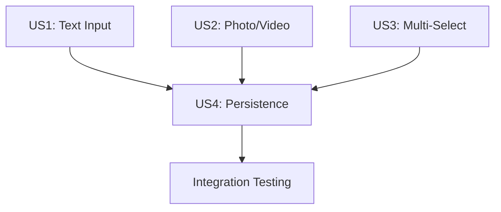

# Implementation Plan: Session Responses + Guest Runtime

**Branch**: `060-session-responses` | **Date**: 2026-02-04 | **Spec**: [spec.md](./spec.md)
**Input**: Feature specification from `/specs/060-session-responses/spec.md`

## Summary

Update the session schema and guest runtime to use a unified `responses[]` array instead of separate `answers[]` and `capturedMedia[]` fields. This consolidates all step responses into a single data structure with consistent shape across input and capture steps, enabling simpler data access and future prompt expansion features.

## Technical Context

**Language/Version**: TypeScript 5.7.2 (strict mode)
**Primary Dependencies**: Zod 4.1.12 (validation), Zustand 5.x (state), TanStack Query 5.66.5 (data fetching), Firebase SDK 12.5.0 (Firestore)
**Storage**: Firebase Firestore (document path: `/projects/{projectId}/sessions/{sessionId}`)
**Testing**: Vitest (unit tests for shared package and app)
**Target Platform**: Web (TanStack Start), mobile-first responsive
**Project Type**: Monorepo with apps/clementine-app (frontend) and packages/shared (schemas)
**Performance Goals**: Page load < 2s on 4G, responses sync < 500ms
**Constraints**: Backward compatible with existing `answers[]` and `capturedMedia[]` fields
**Scale/Scope**: Updates 7 files across 2 packages

## Constitution Check

*GATE: Must pass before Phase 0 research. Re-check after Phase 1 design.*

| Principle | Status | Notes |
|-----------|--------|-------|
| I. Mobile-First Design | ✅ PASS | No UI changes, only data layer |
| II. Clean Code & Simplicity | ✅ PASS | Simplifies data model by unifying two arrays into one |
| III. Type-Safe Development | ✅ PASS | Using Zod schemas, TypeScript strict mode |
| IV. Minimal Testing Strategy | ✅ PASS | Unit tests for schema validation and store actions |
| V. Validation Gates | ✅ PASS | Will run format, lint, type-check before commit |
| VI. Frontend Architecture | ✅ PASS | Maintaining client-first pattern with Firestore |
| VII. Backend & Firebase | ✅ PASS | Using Firestore transactions for data integrity |
| VIII. Project Structure | ✅ PASS | Following existing domain structure |

**Post-Design Re-check (2026-02-04)**: All principles still pass after Phase 1 design. Data model and implementation approach align with existing patterns.

**Standards to Review**:
- `global/zod-validation.md` - Schema patterns for SessionResponse
- `backend/firestore.md` - Firestore update patterns
- `frontend/state-management.md` - Zustand store patterns

## Project Structure

### Documentation (this feature)

```text
specs/060-session-responses/
├── spec.md              # Feature specification
├── plan.md              # This file
├── research.md          # Phase 0 output
├── data-model.md        # Phase 1 output
├── quickstart.md        # Phase 1 output (manual testing guide)
└── checklists/
    └── requirements.md  # Specification quality checklist
```

### Source Code (repository root)

```text
packages/shared/src/schemas/session/
├── session.schema.ts           # MODIFY: Add responses field
├── session-response.schema.ts  # EXISTS: Already has SessionResponse schema
└── index.ts                    # MODIFY: Export new types if needed

apps/clementine-app/src/domains/
├── experience/runtime/
│   ├── stores/
│   │   └── experienceRuntimeStore.ts  # MODIFY: Add responses state + setResponse action
│   ├── hooks/
│   │   └── useRuntime.ts              # MODIFY: Expose setResponse, getResponse, getResponses
│   ├── containers/
│   │   └── ExperienceRuntime.tsx      # MODIFY: Sync responses to Firestore
│   └── types/
│       └── runtime.types.ts           # MODIFY: Update RuntimeState type
├── session/shared/
│   └── hooks/
│       └── useUpdateSessionProgress.ts # MODIFY: Accept responses in input
└── guest/components/
    └── GuestRuntimeContent.tsx         # MODIFY: Use setResponse for answers
```

**Structure Decision**: Following existing vertical slice architecture. Changes are isolated to session/experience/guest domains with shared schema updates.

## Implementation Approach

### Phase 1: Schema Foundation (packages/shared)

1. **Update session.schema.ts** to add `responses` field alongside existing deprecated fields
2. **Verify session-response.schema.ts** has all required fields (stepId, stepName, stepType, value, context, timestamps)

### Phase 2: Store Layer (apps/clementine-app)

1. **Update experienceRuntimeStore.ts** with `responses` state and `setResponse` action
2. **Update runtime.types.ts** to include responses in RuntimeState

### Phase 3: Hook Layer

1. **Update useRuntime.ts** to expose `setResponse`, `getResponse`, `getResponses` methods

### Phase 4: Sync Layer

1. **Update useUpdateSessionProgress.ts** to accept and write `responses` to Firestore
2. **Update ExperienceRuntime.tsx** to sync `responses` instead of `answers`/`capturedMedia`

### Phase 5: Guest Components

1. **Update GuestRuntimeContent.tsx** to call `setResponse` instead of `setAnswer`

### Migration Strategy

- **Backward Compatible**: Keep `answers[]` and `capturedMedia[]` readable but stop writing to them
- **New Sessions**: Write only to `responses[]`
- **Future Cleanup**: PRD 4 will remove deprecated fields after migration complete

## Key Implementation Details

### SessionResponse Shape

```typescript
interface SessionResponse {
  stepId: string           // Step identifier
  stepName: string         // From step definition, for prompt expansion
  stepType: string         // e.g., "input.shortText", "capture.photo"
  value: string | string[] | null  // Text/scale/yesNo/multiSelect values, null for captures
  context: unknown | null  // MultiSelectOption[] for multi-select, MediaReference[] for captures
  createdAt: number        // Unix timestamp ms
  updatedAt: number        // Unix timestamp ms
}
```

### MediaReference Shape (in context for captures)

```typescript
interface MediaReference {
  mediaAssetId: string
  url: string
  filePath: string      // For Cloud Functions processing
  displayName: string   // From step name
}
```

### Store Action Pattern

```typescript
setResponse: (response: SessionResponse) => {
  set((state) => {
    const existingIndex = state.responses.findIndex(r => r.stepId === response.stepId)
    const newResponses = existingIndex >= 0
      ? state.responses.map((r, i) => i === existingIndex ? response : r)
      : [...state.responses, response]
    return { responses: newResponses }
  })
}
```

## Dependencies



- US1, US2, US3 can be implemented in parallel (different step types)
- US4 (Persistence) depends on all step types being ready
- All user stories share the same schema and store infrastructure

## Complexity Tracking

No constitution violations. This feature simplifies the data model by consolidating two separate arrays into one unified structure.
